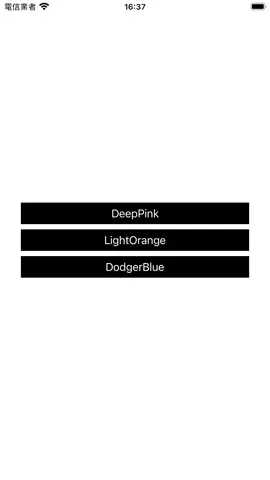

# WWGMTColor

[](https://developer.apple.com/swift/) [](https://developer.apple.com/swift/)  [](https://developer.apple.com/swift/) [](https://developer.apple.com/swift/)

### [Introduction - 簡介](https://swiftpackageindex.com/William-Weng)
- [Convert GMT color codes into a simple and usable enum.](https://www.soest.hawaii.edu/gmt/gmt/html/man/gmtcolors.html)
- [將 GMT 顏色代碼轉換為簡單且可用的列舉。](https://docs.generic-mapping-tools.org/6.5/gmtcolors.html)



### [Installation with Swift Package Manager](https://medium.com/彼得潘的-swift-ios-app-開發問題解答集/使用-spm-安裝第三方套件-xcode-11-新功能-2c4ffcf85b4b)
```js
dependencies: [
    .package(url: "https://github.com/William-Weng/WWGMTColor.git", .upToNextMajor(from: "1.0.1"))
]
```

### [Example]()
```swift
import UIKit
import WWGMTColor

final class ViewController: UIViewController {

    private let colors: [WWGMTColor] = [.deeppink, .lightorange, .dodgerblue]
    
    @IBAction func colorSetting(_ sender: UIButton) {
        view.backgroundColor = colors[sender.tag].color()
    }
}
```
